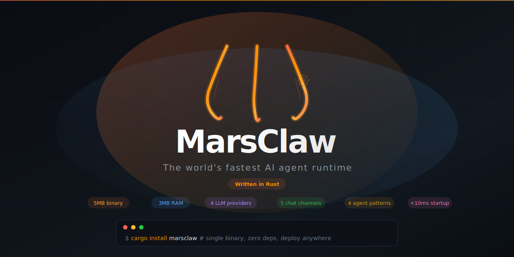

<p align="center">
  
</p>

<p align="center">
  <a href="https://github.com/Marsstein/marsclaw-rs/actions"></a>
  <a href="https://crates.io/crates/marsclaw"></a>
  <a href="https://github.com/Marsstein/marsclaw-rs/blob/main/LICENSE"></a>
  <a href="https://github.com/Marsstein/marsclaw-rs"></a>
  <a href="https://marsclaw.dev"></a>
</p>

<p align="center">
  <a href="#quick-start">Quick Start</a> &middot;
  <a href="#comparison">Comparison</a> &middot;
  <a href="#features">Features</a> &middot;
  <a href="#architecture">Architecture</a> &middot;
  <a href="#configuration">Configuration</a>
</p>

---

**5MB binary · ~3MB RAM · <10ms cold start · Zero CVEs · Zero dependencies**

MarsClaw is a multi-agent AI runtime written in Rust. It connects to Claude, GPT, Gemini, and local models to help you code, automate tasks, and orchestrate multi-agent workflows — all from a single binary with no dependencies.

```
$ marsclaw "add error handling to main.rs"

> read_file
✓ read_file
> edit_file
✓ edit_file

Added error wrapping with anyhow to all three return paths in main().

── claude-sonnet-4 │ 1.2K in / 523 out │ $0.012 session ──
```

## Quick Start

```bash
# Install
cargo install marsclaw

# Or download a binary
curl -sSfL https://marsclaw.dev/install.sh | sh

# Set your API key (pick one)
export ANTHROPIC_API_KEY="sk-ant-..."   # Anthropic
export GEMINI_API_KEY="..."             # Google Gemini
export OPENAI_API_KEY="sk-..."          # OpenAI
# Or use Ollama for free, fully offline — no key needed

# Interactive mode
marsclaw

# Single prompt
marsclaw chat "explain this codebase"

# Use with different providers
marsclaw -m claude-sonnet-4-20250514 "review this PR"
marsclaw -m gemini-2.5-flash "explain this code"
marsclaw -m gpt-4o "write tests for auth.rs"
marsclaw -m llama3.1 "refactor this function"    # Ollama, free

# Web UI
marsclaw serve --addr :8080

# Chat bots
marsclaw telegram        # Telegram bot
marsclaw discord         # Discord bot
marsclaw slack           # Slack bot

# Setup wizard
marsclaw init
```

## Comparison

|  | Claude Code | Aider | Goose | Cursor | OpenHands | **MarsClaw** |
|---|:---:|:---:|:---:|:---:|:---:|:---:|
| **Language** | TypeScript | Python | Python | Electron | Python | **Rust** |
| **Install size** | ~200 MB | ~150 MB | ~120 MB | ~400 MB | ~2 GB | **5 MB** |
| **Memory (idle)** | ~150 MB | ~120 MB | ~100 MB | ~500 MB | ~1 GB | **~3 MB** |
| **Cold start** | ~3s | ~2s | ~2s | ~5s | ~10s | **<10ms** |
| **Runtime deps** | Node.js | Python + pip | Python + pip | Chromium | Docker | **0** |
| **Single binary** | No | No | No | No | No | **Yes** |
| **Known CVEs** | Inherits npm | Inherits pip | Inherits pip | Chromium | Docker | **0** |
| | | | | | | |
| **LLM providers** | Anthropic | 20+ | 10+ | 5+ | 10+ | **4 native + any OpenAI-compatible** |
| **Anthropic (native API)** | Yes | Yes | Yes | Yes | Yes | **Yes** |
| **OpenAI** | No | Yes | Yes | Yes | Yes | **Yes** |
| **Gemini** | No | Yes | Yes | No | Yes | **Yes** |
| **Ollama (fully offline)** | No | Yes | Yes | No | Yes | **Yes** |
| **Any OpenAI-compatible** | No | Yes | Yes | No | Yes | **Yes (Groq, Together, DeepSeek, vLLM, LM Studio)** |
| | | | | | | |
| **Multi-agent orchestration** | No | No | Partial | No | Yes | **4 patterns** |
| **Pipeline (sequential)** | No | No | No | No | Yes | **Yes** |
| **Parallel (fan-out)** | No | No | No | No | No | **Yes** |
| **Debate (adversarial)** | No | No | No | No | No | **Yes** |
| **Supervisor (coordinator)** | No | No | Yes | No | Yes | **Yes** |
| **Sub-agent delegation** | No | No | No | No | No | **Yes** |
| | | | | | | |
| **Chat channels** | 0 | 0 | 0 | 0 | 0 | **5** |
| **Telegram bot** | No | No | No | No | No | **Yes** |
| **Discord bot** | No | No | No | No | No | **Yes** |
| **Slack bot** | No | No | No | No | No | **Yes** |
| **WhatsApp bot** | No | No | No | No | No | **Yes** |
| **Instagram** | No | No | No | No | No | **Yes** |
| | | | | | | |
| **Web dashboard** | No | No | No | Yes | Yes | **Built-in (embedded)** |
| **MCP client** | Yes | No | Yes | No | No | **Yes (JSON-RPC 2.0)** |
| **Persistent memory** | No | No | No | No | No | **Yes (episodic/semantic/procedural)** |
| **Skills / prompt packs** | No | No | No | No | No | **5 built-in + installable** |
| **Scheduled tasks** | No | No | No | No | No | **Cron + intervals** |
| **Cost tracking** | Yes | Yes | No | No | No | **Yes (daily/monthly budgets)** |
| **Credential scanning** | No | No | No | No | No | **Yes** |
| **Tool approval workflow** | Yes | No | No | No | No | **Yes (per danger level)** |
| **Session persistence** | No | Yes | No | No | Yes | **SQLite** |
| **Hook system** | No | No | No | No | No | **Yes (lifecycle events)** |
| **Offline mode** | No | Yes | Yes | No | No | **Yes (Ollama)** |
| **Self-hosted** | No | Yes | Yes | No | Yes | **Yes** |
| **Open source** | No | Yes | Yes | No | Yes | **Yes (Apache-2.0)** |

## Features

### LLM Providers
Connect to any major LLM provider — switch with a single flag:
- **Anthropic** — Claude Opus, Sonnet, Haiku (native Messages API with streaming)
- **OpenAI** — GPT-4o, GPT-4, o1 (+ any OpenAI-compatible endpoint)
- **Google Gemini** — Gemini 2.5 Flash, Pro
- **Ollama** — Llama 3, Mistral, CodeLlama, any local model (free, fully offline)
- **Any OpenAI-compatible API** — Groq, Together, DeepSeek, Azure, vLLM, LM Studio

### Multi-Agent Orchestration
Four built-in patterns for complex workflows:
- **Pipeline** — chain agents sequentially, output of one feeds the next
- **Parallel** — fan-out tasks to multiple agents, aggregate results
- **Debate** — adversarial multi-round discussion between agents with a judge
- **Supervisor** — coordinator agent delegates subtasks to specialist agents

### Built-in Tools (7)
| Tool | Description |
|------|-------------|
| `read_file` | Read files with line ranges |
| `write_file` | Create or overwrite files |
| `edit_file` | Surgical find-and-replace edits |
| `shell` | Execute shell commands with timeout |
| `list_files` | Recursive directory listing with glob |
| `search` | Content search across files (regex) |
| `git` | Read-only git operations (log, diff, status) |

### Channel Integrations (5)
Deploy your agent to any messaging platform:
- **Telegram** — long-polling bot with /start, /clear, /help commands
- **Discord** — Gateway WebSocket with real-time messaging
- **Slack** — Socket Mode with event-driven responses
- **WhatsApp** — Cloud API webhook (auto-mounts on serve)
- **Instagram** — Messenger API integration

### Platform
- **Web dashboard** — embedded single-page UI, zero frontend build needed
- **Skills system** — 5 built-in prompt packs (coder, devops, writer, analyst, compliance) + installable
- **Scheduler** — cron expressions and interval-based task automation
- **MCP support** — JSON-RPC 2.0 client for Zapier, n8n, filesystem, custom MCP servers
- **Persistent memory** — episodic, semantic, and procedural memory backed by SQLite
- **Hook system** — before/after tool calls, LLM calls, and error events
- **Security** — credential scanning, path traversal guards, per-danger-level tool approval
- **Cost tracking** — per-model pricing with daily and monthly budget limits
- **SQLite persistence** — conversation history and sessions with zero config
- **Config** — YAML file + `MARSCLAW_*` env var overrides

## CLI Reference

```
marsclaw [OPTIONS] [COMMAND]

Commands:
  chat              Chat interactively or run single prompt
  serve             Start HTTP server + Web UI
  telegram          Run as Telegram bot
  discord           Run as Discord bot
  slack             Run as Slack bot
  whatsapp          Run WhatsApp webhook bot
  channels add      Connect a messaging channel
  channels list     Show configured channels
  channels remove   Remove a channel
  skills list       Show available skills
  skills install    Install a skill from URL
  skills use        Set the active skill
  init              Interactive setup wizard

Options:
  -c, --config      Config file path
  -m, --model       Override model (e.g., claude-sonnet-4-20250514)
  -v, --verbose     Debug logging
  -h, --help        Print help
  -V, --version     Print version
```

## Architecture

```
src/                        10,500+ lines of Rust
  main.rs                   CLI entry point (clap)
  agent/                    Agent loop + context builder + sub-agent orchestrator
  llm/                      4 providers (Anthropic, OpenAI, Gemini, Ollama) + cost + retry
  tool/                     7 built-in tools (read, write, edit, shell, list, search, git)
  server/                   HTTP server (axum) + embedded Web UI
  store/                    SQLite persistence (rusqlite)
  telegram/                 Telegram bot (long-polling)
  discord/                  Discord bot (Gateway WebSocket)
  slack/                    Slack bot (Socket Mode)
  whatsapp/                 WhatsApp bot (Cloud API webhook)
  channels/                 Channel management CLI
  orchestration/            Multi-agent patterns (pipeline, parallel, debate, supervisor)
  memory/                   Persistent memory system (SQLite)
  hooks/                    Agent lifecycle hooks
  mcp/                      MCP JSON-RPC 2.0 client
  skills/                   Installable prompt packs
  scheduler/                Cron-based task automation
  security/                 Credential scanning + path guards
  config/                   YAML + env var configuration
  terminal/                 Interactive REPL
  setup/                    Setup wizard
  types/                    Shared types and traits
```

## Configuration

Config lives at `~/.marsclaw/config.yaml`:

```yaml
providers:
  default: anthropic
  anthropic:
    api_key_env: ANTHROPIC_API_KEY
    default_model: claude-sonnet-4-20250514
  gemini:
    api_key_env: GEMINI_API_KEY
    default_model: gemini-2.5-flash
  openai:
    api_key_env: OPENAI_API_KEY
    default_model: gpt-4o
  ollama:
    default_model: llama3.1

agent:
  max_turns: 25
  enable_streaming: true
  temperature: 0.0

cost:
  daily_budget: 10.0
  monthly_budget: 100.0

security:
  scan_credentials: true
  path_traversal_guard: true

# MCP servers
mcp:
  - name: n8n
    command: npx
    args: ["-y", "@anthropic/mcp-n8n", "--webhook-url", "http://localhost:5678"]

# WhatsApp webhook (auto-mounts on serve)
whatsapp:
  phone_number_id: "123456789"
  access_token: "EAAx..."
  verify_token: "marsclaw_verify"

# Scheduled tasks
scheduler:
  tasks:
    - id: daily-report
      name: "Daily Summary"
      schedule: "0 9 * * *"
      prompt: "Generate a daily summary of recent changes"
      channel: log
```

Environment variables override config: `MARSCLAW_PROVIDER=ollama`, `MARSCLAW_MODEL=llama3.1`, etc.

## Contributing

```bash
git clone https://github.com/Marsstein/marsclaw-rs.git
cd marsclaw-rs
cargo build             # debug build
cargo test              # run 43 tests
cargo clippy            # lint
cargo build --release   # optimized 5MB binary
```

## License

Apache-2.0
